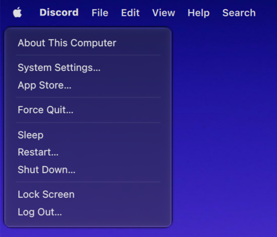
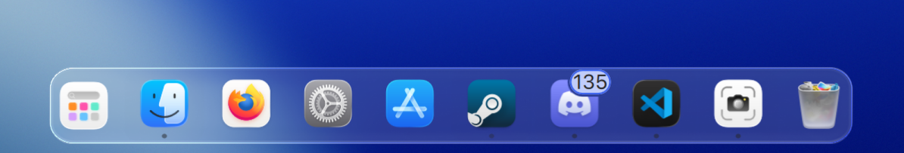
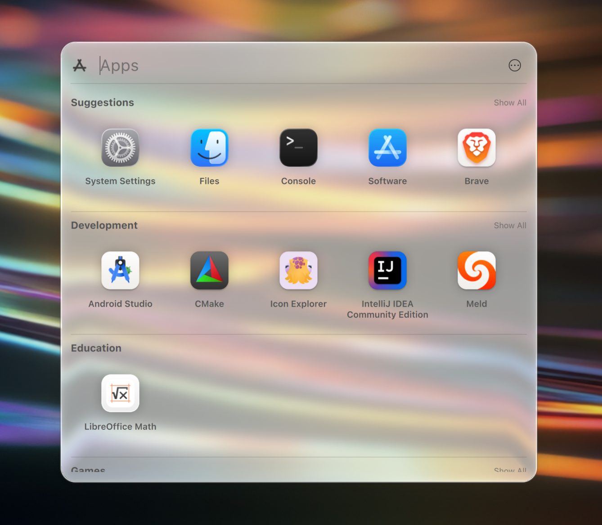
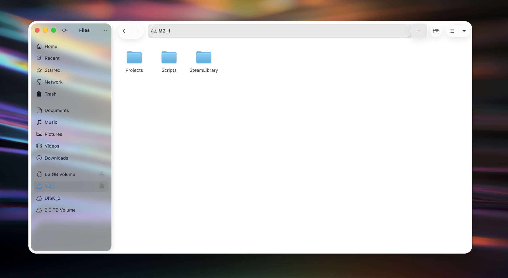

# macOS Tahoe Liquid Theme for KDE Plasma

[](https://github.com/lestercorderomurillo/macos-tahoe-liquid-kde/releases) [](https://github.com/lestercorderomurillo/macos-tahoe-liquid-kde/actions/workflows/test.yml) [](https://github.com/lestercorderomurillo/macos-tahoe-liquid-kde/actions/workflows/test.yml) [](LICENSE) [](https://kde.org/plasma-desktop/) [](https://github.com/lestercorderomurillo/macos-tahoe-liquid-kde/commits/) [](https://github.com/lestercorderomurillo/macos-tahoe-liquid-kde/stargazers) [](https://github.com/lestercorderomurillo/macos-tahoe-liquid-kde/issues)

> [!CAUTION]
> **Very experimental** — Under heavy active development. Things will break. Back up your system config before installing. Use at your own risk.

A full macOS Tahoe-style desktop experience for KDE Plasma 6.6+.

A complete environment, not just a coat of paint.

---

## Roadmap

| Component | Description | Status |
|-----------|-------------|--------|
| **Color Schemes** | Light and Dark color palettes | ✅ |
| **Wallpapers** | Tahoe, Heritage, Beach, Landscape | ✅ |
| **Fonts** | SF Pro Display, Text, Rounded, Mono | ✅ |
| **Cursors** | Tahoe style cursors | ✅ |
| **Icons** | Full icon set (light & dark) | 🔧 |
| **Sounds** | Notification and event sounds | 🔧 |
| **Plasma Theme** | Translucent panels + close/min/max buttons | 🔧 |
| **Kvantum Theme** | Kvantum theme | 🔧 |
| **GTK Theme** | GTK2/3/4 window chrome and controls | 🔧 |
| **Acrylic Glass** | KWin blur, rounded corners, glass effect | 🔧 |
| **Auto Theme Switcher** | Auto light/dark via Plasma native sunrise/sunset | ✅ |
| **Aurorae Decorations** | Window title bar and borders | 🔧 |
| **Firefox Theme** | Firefox browser theme | 🔲 |
| **Thunderbird Theme** | Thunderbird mail theme | 🔲 |
| **Konsole Theme** | Terminal profile | 🔲 |
| **Kate Theme** | Text editor theme | 🔲 |
| **SDDM Theme** | Login and lock screen | 🔲 |
| **Menu Plasmoid** | System menu with configurable icons | 🔧 |
| **Launcher Plasmoid** | App grid launcher | 🔧 |
| **Trashcan Plasmoid** | Trash widget with configurable icons | 🔧 |
| **Calendar Plasmoid** | Calendar dropdown | 🔲 |
| **Control Center Plasmoid** | Quick settings panel | 🔲 |
| **System Preferences Plasmoid** | Settings launcher | 🔲 |
| **OS Selector** | Boot manager / OS picker screen | 🔲 |
| **Boot Screen** | Plymouth splash for startup | 🔲 |
| **Shutdown Screen** | Styled logout / shutdown sequence | 🔲 |

---

## Requirements

- KDE Plasma 6.6+
- sudo access

## Screenshots

### Menu

System menu with native QMenu dropdown.

<table align="center"><tr>
<td align="center"><br><sub>Light Variant</sub></td>
<td align="center"><br><sub>Dark Variant</sub></td>
</tr></table>

### About This Computer

Glass window with system info.

<table align="center"><tr>
<td align="center"><br><sub>Light Variant</sub></td>
<td align="center"><br><sub>Dark Variant</sub></td>
</tr></table>

### Tahoe Dock

Floating glass dock with app icons.

<p align="center">
  <br>
  <sub>Light Variant</sub>
</p>

### Tahoe Launcher

App grid with categories and search.

<p align="center">
  <br>
  <sub>Light Variant</sub>
</p>

### Tahoe Finder

Nautilus file manager with macOS-style sidebar.

<p align="center">
  <br>
  <sub>Light Variant</sub>
</p>

### Plasma Theme

Desktop right-click with translucent glass blur.

<p align="center">
  <br>
  <sub>Light Variant</sub>
</p>

---

## Usage

```bash
bash install.sh                                  # install everything
bash install.sh --help                           # show all options
bash uninstall.sh                                # uninstall, reset to Breeze
```

Both scripts ask for confirmation, request sudo, and restart Plasma automatically.

### Feature Flags

Every component has a CLI flag. Use `--no-` to skip, or `--only` to run just the listed ones:

```bash
bash install.sh --no-gtk --no-sddm               # skip GTK and SDDM
bash install.sh --only --fonts --icons           # install only fonts and icons
bash uninstall.sh --only --cursors               # uninstall only cursors
```

Available flags:

| | | | |
|---|---|---|---|
| `--wallpapers` | `--fonts` | `--cursors` | `--plasma-theme` |
| `--window-decorations` | `--kvantum` | `--color-schemes` | `--icons` |
| `--plasmoids` | `--acrylic-glass` | `--global-theme` | `--layout` |
| `--sounds` | `--gtk` | `--sddm` | `--apps` |

Use `--no-download` to skip asset downloads and use cached files.

### Theme Mode

```bash
bash install.sh                                  # auto (default)
bash install.sh --dark                           # force dark
bash install.sh --light                          # force light
```

- **`--auto`** enables Plasma's native autoswitcher, which transitions between light and dark based on sunrise/sunset times. A watcher service keeps Kvantum and GTK in sync.
- **`--light`** / **`--dark`** forces one mode and disables the autoswitcher.

After install, you can switch manually:

```bash
mac-tahoe-theme-switch light                     # force light (disables auto)
mac-tahoe-theme-switch dark                      # force dark (disables auto)
mac-tahoe-theme-switch auto                      # re-enable auto (sunrise/sunset)
```

### Persistence

```bash
bash install.sh --no-gtk --dark --save           # save settings to features.json
bash install.sh                                  # reuses saved features.json
bash install.sh --reset                          # reset features.json to defaults
```

---

## Repository Structure

```
macos-tahoe-liquid-kde/
├── install.sh              # main installer (thin orchestrator)
├── uninstall.sh            # uninstaller (resets to Breeze)
├── features.json           # toggle individual components on/off
└── src/
    ├── mirrors/            # download source definitions (JSON)
    │   ├── wallpapers.json
    │   ├── fonts.json
    │   ├── icons.json
    │   └── cursors.json
    ├── screenshots/        # documentation screenshots
    ├── offline/            # assets bundled in-repo (no download needed)
    │   ├── plasma-theme/   # Plasma desktop theme (transparent glass dock)
    │   ├── color-schemes/  # KDE color schemes
    │   ├── kvantum/        # Kvantum Qt theme (blur + translucency)
    │   ├── gtk/            # GTK 2/3/4 theme
    │   ├── aurorae/        # macOS-style window decorations
    │   ├── plasmoids/      # custom Plasma widgets
    │   ├── kwin-effects/   # Acrylic Glass KWin effect (built from source)
    │   ├── layouts/        # panel layout scripts
    │   ├── sounds/         # notification and event sounds
    │   ├── sddm/           # login screen theme
    │   └── theme-switch.sh # auto light/dark theme switcher
    └── steps/              # self-contained installer steps
        ├── functions.sh    # shared utilities (logging, fetch, extract, mirrors)
        ├── wallpapers/     # each step is a folder with step.sh inside
        ├── fonts/          # step.sh defines: deps(), download(), build(),
        ├── cursors/        #   install(), uninstall()
        ├── icons/
        ├── plasma-theme/
        ├── window-decorations/
        ├── kvantum/
        ├── color-schemes/
        ├── gtk/
        ├── plasmoids/
        ├── menu/
        ├── globalmenu/
        ├── acrylic-glass/
        ├── layout/
        ├── theme-switch/
        └── apply/
```

---

## What the Installer Does

### Appearance

| Component | What it installs | Location |
|-----------|-----------------|----------|
| **Color Schemes** | Light and Dark palettes for all KDE apps | `~/.local/share/color-schemes/` |
| **Global Theme** | Look-and-feel packages (light + dark variants) | `~/.local/share/plasma/look-and-feel/` |
| **Plasma Theme** | Translucent glass panels and dock styling | `~/.local/share/plasma/desktoptheme/` |
| **Kvantum** | Qt widget theme with blur and translucency | `~/.config/Kvantum/` |
| **GTK** | GTK 2/3/4 theme for non-Qt apps (Nautilus, Firefox, etc.) | `~/.themes/` |
| **Icons** | macOS-style icon set with light and dark variants | `~/.local/share/icons/` |
| **Cursors** | macOS-style cursor theme | `~/.local/share/icons/` |
| **Wallpapers** | Tahoe, Heritage, Beach, Landscape collections | `~/.local/share/wallpapers/` |
| **Fonts** | SF Pro Display, Text, Rounded, and SF Mono | `~/.local/share/fonts/` |

### Desktop

| Component | What it installs | Location |
|-----------|-----------------|----------|
| **Layout** | Transparent top bar + floating glass dock | Panel config via JS scripting API |
| **Menu** | macOS-style system menu with native QMenu and configurable icons | Compiled C++ plasmoid (system-wide) |
| **Launcher** | App grid with categories and search | `~/.local/share/plasma/plasmoids/` |
| **Trashcan** | Dock trash widget with configurable icons | `~/.local/share/plasma/plasmoids/` |
| **Window Decorations** | macOS-style title bars (Aurorae) | `~/.local/share/aurorae/themes/` |

### Effects and Services

| Component | What it installs | Location |
|-----------|-----------------|----------|
| **Acrylic Glass** | KWin blur + rounded corners effect (built from source) | `/usr/lib/qt6/plugins/kwin/effects/` |
| **Theme Switcher** | Auto light/dark via Plasma native sunrise/sunset | `~/.local/bin/mac-tahoe-theme-switch` |
| **Watcher Service** | Keeps Kvantum and GTK in sync with Plasma theme | systemd user service |
| **Sounds** | Notification and event sounds | `~/.local/share/sounds/` |
| **SDDM** | macOS-style login screen | `/usr/share/sddm/themes/` |

### Config Files Modified

| File | What changes |
|------|-------------|
| `~/.config/kdeglobals` | Fonts, color scheme, icon theme, auto dark mode |
| `~/.config/kwinrc` | Window decorations, Acrylic Glass effect |
| `~/.config/plasmashellrc` | Panel opacity, floating dock style |
| `~/.config/plasmarc` | Active Plasma theme |

The uninstaller reverses all changes and resets to Breeze defaults.

---

## Disclaimer

This project is an independent reimplementation inspired by the macOS aesthetic. No assets, code, or intellectual property from Apple Inc. have been copied or redistributed. All themes, icons, plasmoids, and configurations are original work or derived from open-source projects under compatible licenses. "macOS" and "Apple" are trademarks of Apple Inc. This project is not affiliated with or endorsed by Apple.

---

## License

[MIT](LICENSE)
