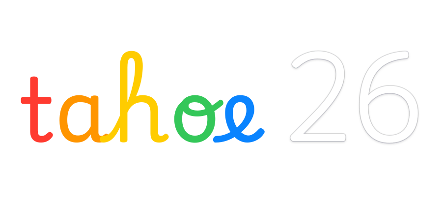
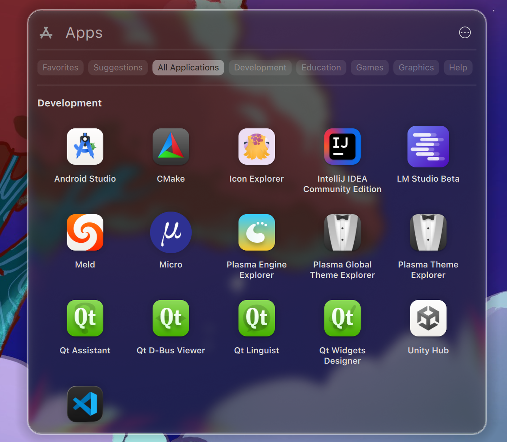
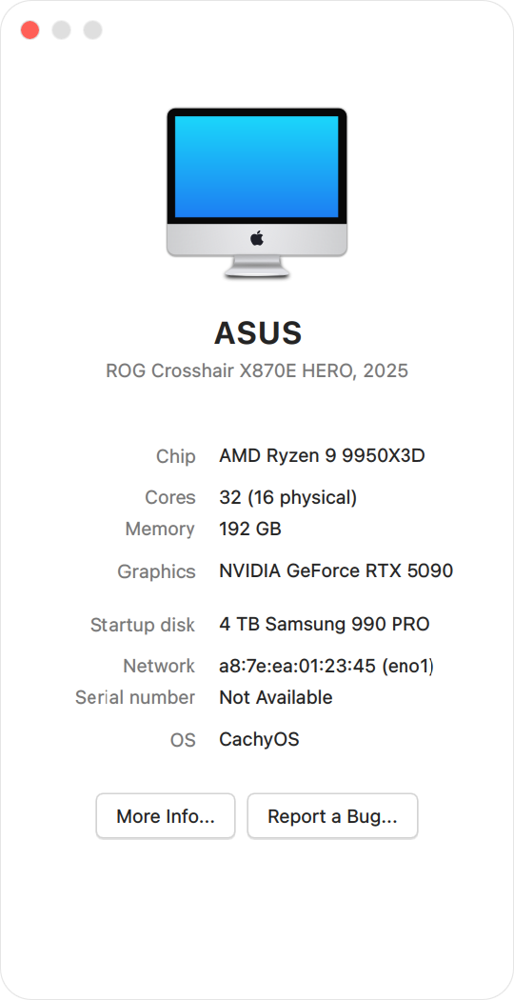
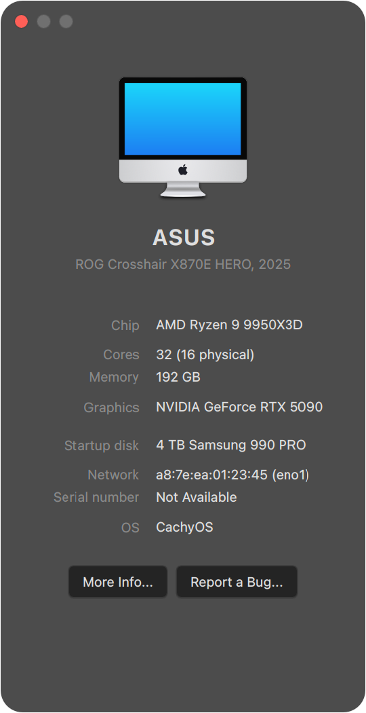
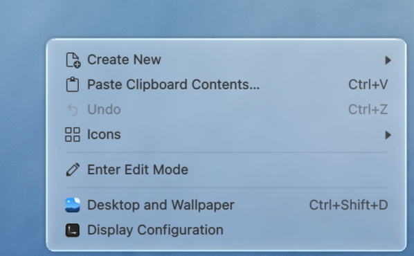
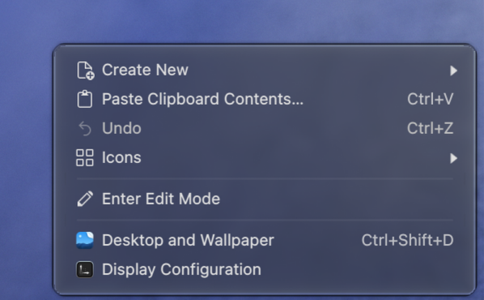

<p align="center">
  
</p>

# macOS Tahoe Liquid Theme for Plasma 6.6/6.7+

[](https://github.com/lestercorderomurillo/macos-tahoe-liquid-kde/releases) [](https://github.com/lestercorderomurillo/macos-tahoe-liquid-kde/actions/workflows/test.yml) [](https://kde.org/plasma-desktop/) [](LICENSE) [](https://github.com/lestercorderomurillo/macos-tahoe-liquid-kde/issues/new)

Introducing macOS Tahoe, reimagined for Linux.

The complete Tahoe experience, from liquid glass and the top menu bar to the Dock, apps, sounds, and boot screen, brought natively to KDE Plasma 6.6 and 6.7+.

> [!CAUTION]
> This project is experimental and under active development. Don't use it on a production system yet. KDE, KWin, or Kvantum updates may temporarily break parts of the theme; running `sudo ./install` again usually restores them. If something goes wrong, please [open an issue](https://github.com/lestercorderomurillo/macos-tahoe-liquid-kde/issues/new).

<br>


### Acrylic Glass Tahoe Launcher

Closer to the real design. Quick search, a favorites capsule, and two view modes.

<p align="center">
  
  
</p>

<br>

### Acrylic Glass Tahoe Dock

Liquid-glass depth with wallpaper refraction and macOS-style notification badges.

<p align="center">
  
</p>

<br>

### Acrylic Glass Tahoe Finder

Nautilus reshaped into Finder, with a macOS-style sidebar and clean chrome. Light and dark.

<p align="center">
  
  
</p>

<br>

### Acrylic Glass Tahoe Menu

Unified menu bar with native dropdowns. System menu, app name, and window controls in the top panel.

<p align="center">
  
  
</p>

<br>

### System Information

Glass system information window.

<p align="center">
  
  
</p>

<br>

### Plasma Theme

Desktop right-click with translucent glass blur.

<p align="center">
  
  
</p>

<br>

### Boot Splash

Plymouth boot screen with centered Apple-style logo on every monitor, scaled dynamically from 1080p to 4K. Boot mode shows a progress bar; shutdown / reboot share the same layout without the bar. On LUKS2-encrypted installs the passphrase prompt renders under the logo with a masked field.

<p align="center">
  
  
</p>

<br>


Use the graphical installer to choose what to install or remove:

```bash
./installer
```

For the terminal wizard:

```bash
sudo ./install
sudo ./uninstall
```

Both installers use the same feature system and show live progress. Run `sudo ./install --help` for every command-line option.

<br>

<details>
<summary><b>Requirements</b></summary>

- KDE Plasma 6.6+
- Python 3.10+
- `sudo`
- Qt 6 path discovery: `qmake6`, `qtpaths6`, `pkg-config` with `Qt6Core.pc`, or a recognized distro layout
- KDE and Qt 6 development packages for the compiled plasmoids and KWin effects
- `cmake`, `g++`, and `pkg-config` when compiled features are selected
- `dbus-send`
- `systemctl` or `crontab` for scheduled features

Fonts, icons, cursors, wallpapers, plasmoids, and Acrylic Glass ship with the repository. KDE Rounded Corners is downloaded from a pinned release, checksum-verified, and skipped cleanly when unavailable.

| Distro | Qt 6 tools | KDE Plasma 6 development packages |
|--------|------------|-----------------------------------|
| Arch family | `pacman -S qt6-tools` | `pacman -S extra-cmake-modules plasma-workspace kdecoration libplasma libnotificationmanager libksysguard plasma-activities-stats` |
| Gentoo | `emerge dev-qt/qttools:6` | `emerge kde-frameworks/extra-cmake-modules kde-plasma/plasma-workspace kde-plasma/kdecoration kde-plasma/libplasma kde-plasma/libnotificationmanager kde-plasma/libksysguard kde-plasma/plasma-activities-stats` |
| Fedora family | `dnf install qt6-qttools-devel` | `dnf install extra-cmake-modules plasma-workspace-devel kdecoration-devel libplasma-devel knotifications-devel libksysguard-devel kf6-plasma-activities-devel` |
| openSUSE Tumbleweed | `zypper install qt6-tools-devel` | `zypper install extra-cmake-modules plasma6-workspace-devel kdecoration-devel libKF6Plasma-devel libnotificationmanager6-devel libksysguard6-devel libKF6PlasmaActivitiesStats6-devel` |

</details>

<details>
<summary><b>Choose features and theme mode</b></summary>

Any flag skips the terminal wizard. Use `--no-<name>` to leave out a component, or `--only` to install or remove selected components:

```bash
sudo ./install --no-gtk --no-sddm
sudo ./install --only --fonts --icons
sudo ./uninstall --only --cursors
```

Available feature names:

`wallpapers`, `fonts`, `cursors`, `plasma-theme`, `window-decorations`, `kvantum`, `color-schemes`, `icons`, `plasmoids`, `globalmenu`, `acrylic-glass`, `rounded-corners`, `global-theme`, `layout`, `sounds`, `gtk`, `firefox`, `sddm`, `apps`, `nautilus`, `nautilus-bookmarks`, `portals`, `oled-care`, `plymouth`.

Choose the initial theme mode:

```bash
sudo ./install          # automatic light/dark schedule
sudo ./install --light
sudo ./install --dark
```

Switch later with:

```bash
mac-tahoe-theme-switch light
mac-tahoe-theme-switch dark
mac-tahoe-theme-switch auto
```

Save or reset installer choices:

```bash
sudo ./install --no-gtk --dark --save
sudo ./install --reset
```

Useful maintenance options:

- `--preflight` checks the system without installing.
- `--no-apply-theme` stages files without switching the desktop.
- `--no-grub-modify` leaves `/etc/default/grub` unchanged.
- `--reset-wallpapers` restores the bundled wallpaper choice.
- `./legacy-install` and `./legacy-uninstall` use the classic prompt instead of the terminal wizard.

</details>

<details>
<summary><b>Firefox theme and profile safety</b></summary>

The installer themes every initialized Firefox-family profile it finds in
native, Flatpak, and Snap locations while preserving the profile's browser
data and existing customizations. Restart each running browser when convenient
to load the CSS.

Each profile receives a timestamped snapshot of `profiles.ini`, `prefs.js`,
`user.js`, and its complete `chrome` tree under
`~/.local/state/mac-tahoe-liquid-kde/firefox/snapshots/`. Changes begin only
after the backup completes. Existing shared-theme layouts are preserved during
migration, and the project's marked additions can be cleanly removed on
uninstall. Snapshots remain available for manual recovery.

</details>

<details>
<summary><b>OLED care</b></summary>

OLED care is off by default. Enable it in the graphical feature picker or from the command line:

```bash
sudo ./install --oled-care
sudo ./install --oled-care --save
sudo ./install --no-oled-care
sudo ./install --oled-care --oled-interval=3 --oled-max-shift=4
```

Manual controls:

```bash
mac-tahoe-oled-care shift
mac-tahoe-oled-care restore
mac-tahoe-oled-care status
```

</details>

<details>
<summary><b>Test in a virtual machine</b></summary>

`./vm <distro>` opens a disposable graphical Plasma machine with the repository mounted and the installer ready. `./vm all` launches the whole matrix.

The Neon profile keeps the host mount read-only and refreshes a writable guest
copy at `/home/tester/macos-tahoe-liquid-kde` on login, because its source-built
Qt6 components need a writable `build/` directory.

```bash
./vm cachyos
./vm arch
./vm manjaro
./vm endeavouros
./vm garuda
./vm fedora
./vm nobara
./vm opensuse
./vm neon
./vm gentoo
./vm gentoo-openrc
./vm all
```

Supported names: `cachyos`, `arch`, `manjaro`, `endeavouros`, `garuda`, `fedora`, `nobara`, `opensuse`, `neon`, `gentoo`, and `gentoo-openrc`.

</details>

<br>


**Distributions**

| | Name | Harness |
|:--:|------|---------|
|  | CachyOS |  |
|  | Arch Linux |  |
|  | EndeavourOS |  |
|  | Fedora |  |
|  | Manjaro |  |
|  | Garuda Linux |  |
|  | Nobara |  |
|  | openSUSE Tumbleweed |  |
|  | Gentoo |  |
|  | [KDE neon](https://github.com/lestercorderomurillo/macos-tahoe-liquid-kde/issues/64) |  |

<br>

**Init systems**

| Init system | Support | Testing |
|-------------|---------|---------|
| systemd | Supported | Completed |
| OpenRC | Supported | In progress |

<br>

**Plasma versions**

| Plasma | Support | Since |
|--------|---------|-------|
| 6.5 and older | Not supported | Not applicable |
| 6.6 | Supported | v0.1.0 |
| 6.7+ | Supported | v0.19.0 |

<br>


Most of the desktop is ready. Icons and multi-distro support are still being polished; the remaining app themes and plasmoids are planned.

<details>
<summary><b>Open the full roadmap</b></summary>

| Component | Description | Status |
|-----------|-------------|:------:|
| Color Schemes | Light and dark desktop palettes | Completed |
| Wallpapers | Tahoe Iridescence and Landscape variants | Completed |
| Fonts | SF Pro Display, Text, Rounded, and Mono | Completed |
| Cursors | Tahoe-style pointers | Completed |
| Plasma Theme | Translucent panels and shell surfaces | Completed |
| Kvantum Theme | Matching Qt app styling | Completed |
| GTK Theme | Matching GTK 2, 3, and 4 styling | Completed |
| Acrylic Glass | Blur and glass effects across the desktop | Completed |
| KDE Rounded Corners | Rounded windows built for the installed KWin | Completed |
| Auto Theme Switcher | Scheduled light and dark desktop modes | Completed |
| OLED Care | Optional panel pixel shifting | Completed |
| Installer UI | Graphical installer with a feature picker | Completed |
| Installer TUI | Terminal feature picker and live progress | Completed |
| Aurorae Decorations | macOS-style title bars and controls | Completed |
| Global Menu | App menus in the top bar | Completed |
| Dock Task Manager | Dock with notification badges | Completed |
| Nautilus | Finder-style file manager setup | Completed |
| Launcher | Searchable app grid | Completed |
| Trash | Dock Trash widget | Completed |
| Sounds | Notification and event sounds | Completed |
| Boot Screen | Plymouth startup splash | Completed |
| Shutdown Screen | Matching shutdown sequence | Completed |
| Icons | Complete light and dark icon set | In progress |
| Multi-Distro Support | Arch, Fedora, openSUSE, and Gentoo families | In progress |
| Firefox Theme | Matching browser CSS with per-profile backup and restore | Completed |
| Konsole Theme | Matching terminal profile | Planned |
| Kate Theme | Matching editor theme | Planned |
| SDDM Theme | Login and lock screen | Planned |
| Calendar | Calendar dropdown | Planned |
| Control Center | Quick settings panel | Planned |
| System Preferences | macOS-style settings launcher | Planned |
| OS Selector | Boot manager and OS picker | Planned |

</details>

<br>


Bug reports are the most valuable contribution right now: **[open an issue](https://github.com/lestercorderomurillo/macos-tahoe-liquid-kde/issues/new)** or choose **Apple menu → About This Computer → Report a Bug…** from the desktop.

Please include:

- Your Plasma version: `plasmashell --version`
- Your distro: `grep PRETTY_NAME /etc/os-release`
- The theme version: `cat VERSION`
- A screenshot or recording for visual issues

Pull requests are welcome. Keep them focused and test them with the `./vm` harness before submitting. See [CONTRIBUTING.md](CONTRIBUTING.md) for the project workflow.

<br>


This is an independent reimplementation inspired by the macOS aesthetic. It is not affiliated with or endorsed by Apple or KDE. "macOS" and "Apple" are trademarks of Apple Inc.

The bundled wallpapers, system sounds, and SF Pro / SF Mono fonts remain Apple's property and are not covered by this project's license. All other code and theme assets are original or derived from compatibly licensed open-source work.

Licensed [GPL-3.0](LICENSE).

<br>


Thanks to the open-source projects that inspired this one or fed assets into it. Everything here is maintained independently:

- **[EliverLara](https://github.com/EliverLara/TahoeLauncher)**: `TahoeLauncher`, the inspiration for the Launcher plasmoid.
- **[vinceliuice](https://github.com/vinceliuice)**: `MacTahoe-icon-theme` for the icons, cursors, and GTK inspiration; and the [`MacTahoe-gtk-theme` Firefox CSS/SVG](https://github.com/vinceliuice/MacTahoe-gtk-theme/tree/main/other/firefox), maintained here as an MIT-licensed fork and integrated with this project's profile backup and restore system.
- **[taj-ny](https://github.com/taj-ny/kwin-effects-forceblur)** and **[4v3ngR](https://github.com/4v3ngR/kwin-effects-glass)**: Better Blur and its glass fork, the starting point of the Acrylic Glass effect (the KWin blur authors stay credited in the source headers).
- **[luisbocanegra](https://github.com/luisbocanegra/plasma-panel-colorizer)**: `plasma-panel-colorizer` v7.3.0, bundled offline and installed by the layout step to tint the panels (GPL-3.0, license shipped alongside).
- **[Matin Lotfaliei / KDE-Rounded-Corners](https://github.com/matinlotfali/KDE-Rounded-Corners)**: the GPL-3.0 KWin rounded-window effect, fetched from the pinned v0.9.0 release and built online against the host KWin SDK (license installed alongside).
- **[ful1e5](https://github.com/ful1e5)**: `apple_cursor`, inspiration for an alternate macOS-style cursor.
- **[sahibjotsaggu](https://github.com/sahibjotsaggu)**: `San-Francisco-Pro-Fonts`, where the SF Pro / SF Mono bundle comes from.
- **[Lucide](https://github.com/lucide-icons/lucide)**: copy icons bundled in the global menu (ISC, © Lucide Contributors).
- **[512pixels.net](https://512pixels.net/projects/default-mac-wallpapers-in-5k/)**: high-resolution macOS wallpaper archive.

Please support their efforts too: star their repos, report bugs upstream, and contribute back when you can.

If a credit is missing, please [open an issue](https://github.com/lestercorderomurillo/macos-tahoe-liquid-kde/issues/new).
