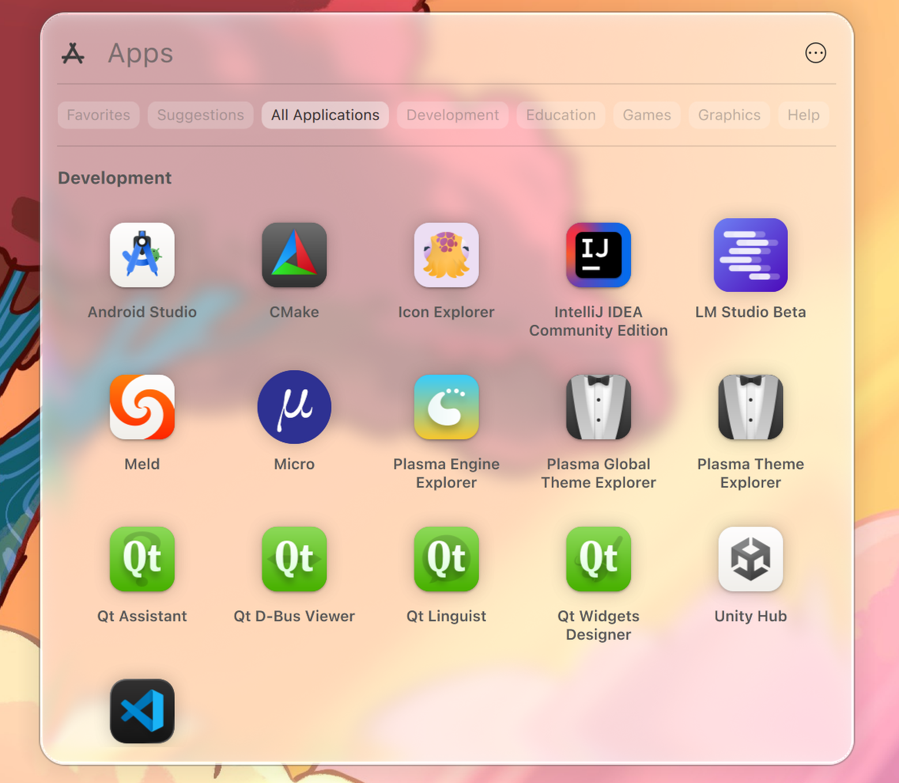
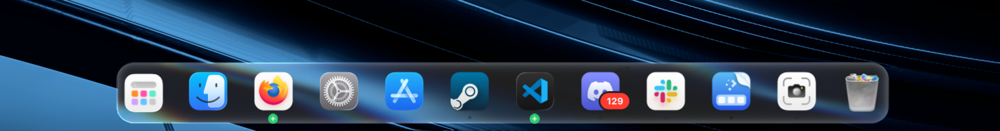
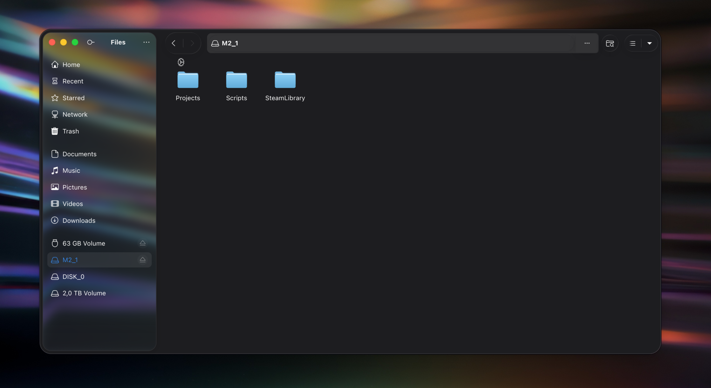
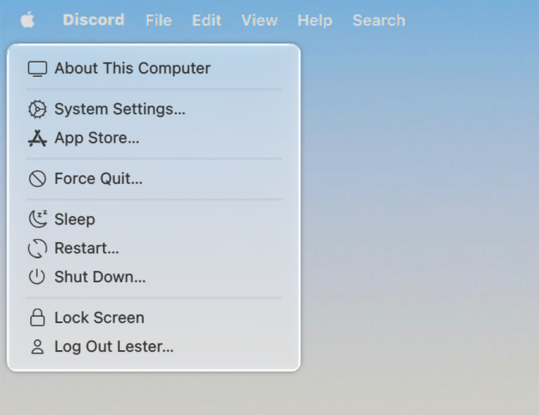
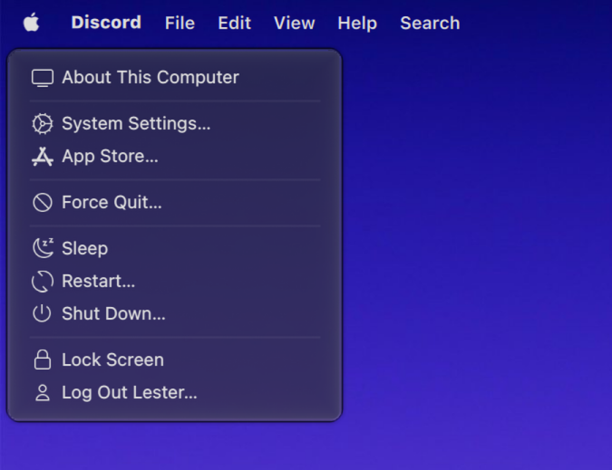
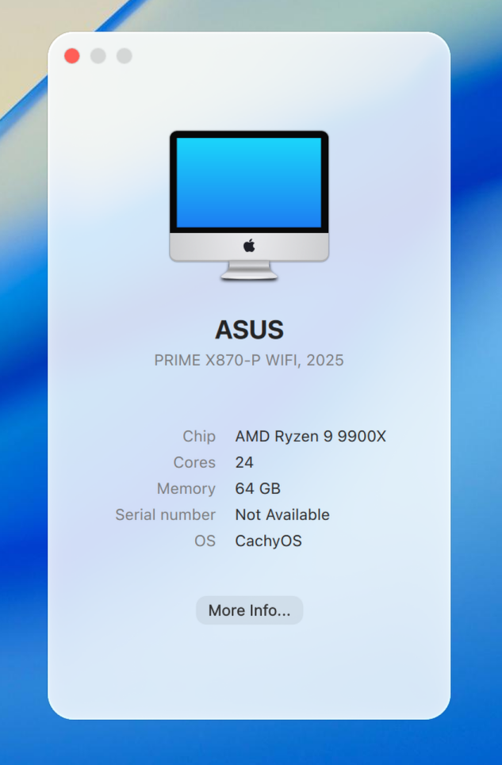
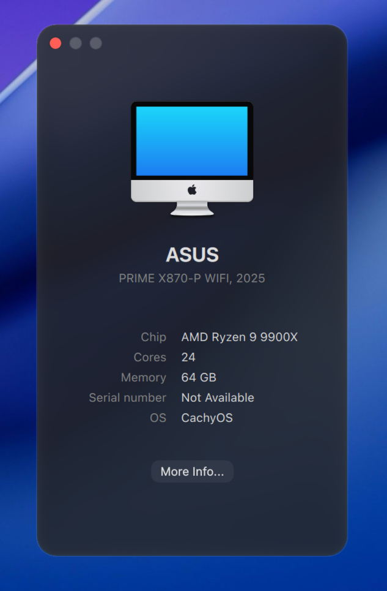
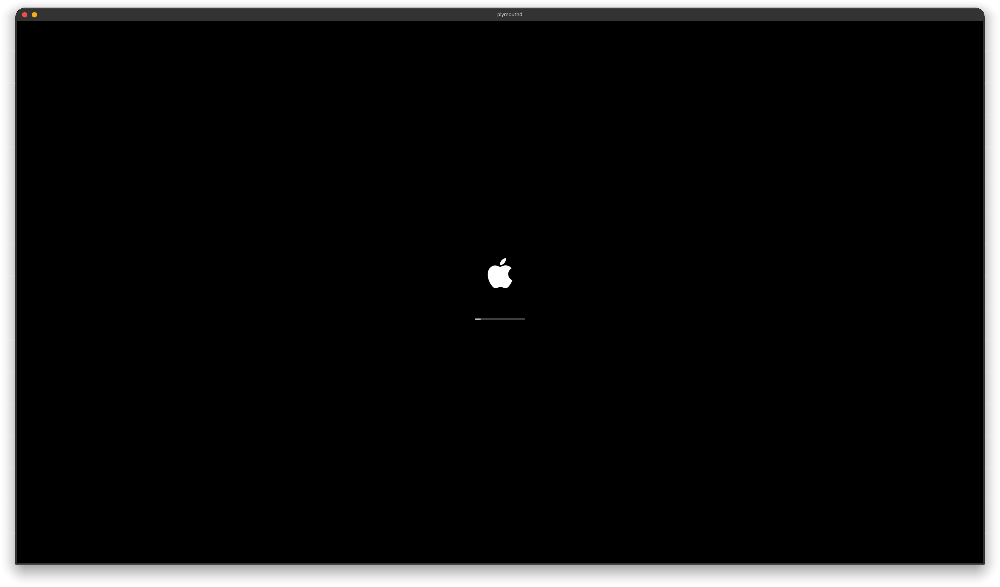
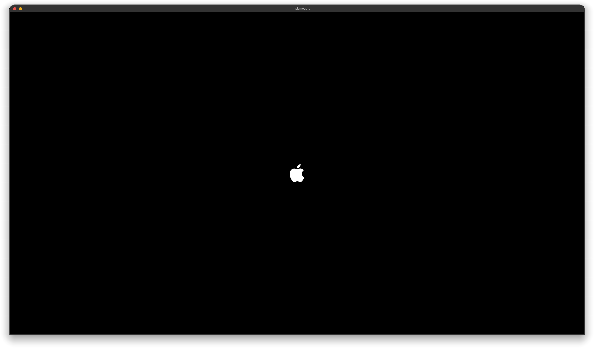

<p align="center">
  
</p>

# macOS Tahoe Liquid Theme for KDE Plasma 6.6/6.7+

[](https://github.com/lestercorderomurillo/macos-tahoe-liquid-kde/releases) [](https://github.com/lestercorderomurillo/macos-tahoe-liquid-kde/actions/workflows/test.yml) [](https://github.com/lestercorderomurillo/macos-tahoe-liquid-kde/actions/workflows/test.yml) [](LICENSE) [](https://kde.org/plasma-desktop/) [](https://github.com/lestercorderomurillo/macos-tahoe-liquid-kde/commits/) [](https://github.com/lestercorderomurillo/macos-tahoe-liquid-kde/issues/new)

> [!WARNING]
> **Alpha / active development.** Things break as KDE, KWin and friends update; the installer pulls upstream changes on launch and may behave differently between runs. Expect rough edges, hold off on production desktops, and please [report any issue](https://github.com/lestercorderomurillo/macos-tahoe-liquid-kde/issues/new) you hit.

A full macOS Tahoe-style desktop experience for KDE Plasma 6.6+.


|     | Distro | Supported yet? | Tested yet? |
|:---:|--------|:--------------:|:-----------:|
|  | CachyOS | ✅ YES | ✅ YES |
|  | Arch Linux | ✅ YES | ✅ YES |
|  | Manjaro | ✅ YES | 🔧 Testing |
|  | EndeavourOS | ✅ YES | 🔧 Testing |
|  | Garuda Linux | ✅ YES | 🔧 Testing |
|  | Fedora | ✅ YES | 🔧 Testing |
|  | Nobara | ✅ YES | 🔧 Testing |
|  | openSUSE Tumbleweed | ✅ YES | 🔧 Testing |
|  | Gentoo | ✅ YES | 🔧 Testing |

| Plasma | Supported yet? | Since |
|--------|:--------------:|:-----:|
| ≤ 6.5 | ❌ NO | — |
| 6.6 | ✅ YES | v0.1.0 |
| 6.7 | ✅ YES | v0.19.0 |

---

<br>


### Tahoe Launcher

App grid with categories and search.

<p align="center">
  
  
</p>

<p align="center">
  <sub>Example of Light and Dark variant.</sub>
</p>

### Tahoe Dock

Liquid-glass dock with macOS-style red notification bubbles and wallpaper refraction.

<p align="center">
  <br>
  <sub>Bright dock glow with the red macOS-style notification bubble.</sub>
</p>

<p align="center">
  <br>
  <sub>Refraction example with the wallpaper visibly bending through the glass surface.</sub>
</p>

<p align="center">
  <br>
  <sub>Dark dock variant with the same liquid-glass depth.</sub>
</p>

### Tahoe Finder

Nautilus file manager with macOS-style sidebar.

<p align="center">
  
  
</p>

<p align="center">
  <sub>Example of Light and Dark variant.</sub>
</p>

### Menu

System menu with native QMenu dropdown.

<p align="center">
  
  
</p>

<p align="center">
  <sub>Example of Light and Dark variant.</sub>
</p>

### System Information

Glass system information window.

<p align="center">
  
  
</p>

<p align="center">
  <sub>Example of Light and Dark variant.</sub>
</p>

### Plasma Theme

Desktop right-click with translucent glass blur.

<p align="center">
  
  
</p>

<p align="center">
  <sub>Example of Light and Dark variant.</sub>
</p>

### Boot Splash

Plymouth boot screen with centered Apple-style logo on every monitor, scaled dynamically from 1080p to 4K. Boot mode shows a progress bar; shutdown / reboot share the same layout without the bar.

<p align="center">
  
  
</p>

<p align="center">
  <sub>Boot mode (with progress bar) and Shutdown mode (logo only).</sub>
</p>

---


| Component | Description | Status |
|-----------|-------------|--------|
| **Color Schemes** | Light and Dark color palettes | ✅ |
| **Wallpapers** | Tahoe Iridescence + Landscape (Morning/Evening/Night) | ✅ |
| **Fonts** | SF Pro Display, Text, Rounded, Mono | ✅ |
| **Cursors** | Tahoe style cursors | ✅ |
| **Plasma Theme** | Translucent panels + close/min/max buttons | ✅ |
| **Kvantum Theme** | Kvantum theme | ✅ |
| **GTK Theme** | GTK2/3/4 window chrome and controls | ✅ |
| **Acrylic Glass** | KWin blur, rounded corners, glass effect | ✅ |
| **Auto Theme Switcher** | One-shot service + 06:00 / 18:00 timer, single entry point | ✅ |
| **Installer UI** | Glass window that drives install / uninstall and a per-feature picker | ✅ |
| **Multi-Distro Support** | KDE Plasma 6.6+ on the Arch, Fedora, openSUSE and Gentoo families | 🔧 |
| **Aurorae Decorations** | Window title bar and borders | ✅ |
| **Global Menu Plasmoid** | Unified menu bar: system menu, app name, window controls, app menus | ✅ |
| **Dock Task Manager** | Icons-only dock applet with macOS-style notification badges | ✅ |
| **Nautilus** | Install Nautilus and set as default file manager on KDE | ✅ |
| **Icons** | Full icon set (light & dark) | 🔧 |
| **Launcher Plasmoid** | App grid launcher | 🔧 |
| **Trashcan Plasmoid** | Trash widget with configurable icons | 🔧 |
| **Sounds** | Notification and event sounds | 🔲 |
| **Firefox Theme** | Firefox browser theme | 🔲 |
| **Konsole Theme** | Terminal profile | 🔲 |
| **Kate Theme** | Text editor theme | 🔲 |
| **SDDM Theme** | Login and lock screen | 🔲 |
| **Calendar Plasmoid** | Calendar dropdown | 🔲 |
| **Control Center Plasmoid** | Quick settings panel | 🔲 |
| **System Preferences Plasmoid** | Settings launcher | 🔲 |
| **OS Selector** | Boot manager / OS picker screen | 🔲 |
| **Boot Screen** | Plymouth splash for startup (1080p–4K) | ✅ |
| **Shutdown Screen** | Styled logout / shutdown sequence | ✅ |

---


<details>
<summary><b>Hard requirements</b> — installer refuses to start without these</summary>

- **KDE Plasma 6.6+** (`plasmashell`, `kwriteconfig6`, `kreadconfig6`, `plasma-apply-lookandfeel`, `plasma-apply-cursortheme`, `plasma-apply-wallpaperimage`, `kpackagetool6`, `kbuildsycoca6`, `qdbus6` *or* `qdbus`)
- **Python 3.10+**
- **`sudo`** (for both `./install` and `./uninstall` — root needed to write the compiled plasmoids + KWin effect under the system Qt6 libdir)
- **Qt6 path discovery** — one of: `qmake6`, `qtpaths6`, or `pkg-config` + `Qt6Core.pc`. The installer asks Qt where its plugin / QML directories live; it refuses to guess. If none of those tools are installed, the installer falls back to the known libdir convention for your distro **only when that directory actually exists on disk**.
- **`dbus-send`** + **`systemctl`** — both ship with systemd, present on every supported distro.

</details>

<details>
<summary><b>Build toolchain</b> — needed for the compiled plasmoids and KWin effect</summary>

Skipped automatically if you `./install --no-plasmoids --no-acrylic-glass`.

- **`cmake`**
- **`g++`** (GCC C++ compiler)
- **`pkg-config`**

</details>

<details>
<summary><b>KDE / Qt6 development SDK</b> — required by find_package() in the compiled units</summary>

Your distro's KDE Plasma 6 dev meta-package usually pulls these in one shot.

- **Extra CMake Modules** (`ECM`)
- **KF6**: `KCoreAddons`, `KConfig`, `KI18n`, `KWindowSystem`, `KDBusAddons`, `KCMUtils`, `KIconThemes`
- **KDecoration3**, **KWin** headers (`KWinDBusInterface`, `KWinX11DBusInterface`)
- **libplasma**, **libtaskmanager**, **libnotificationmanager**, **KSysGuard**
- **PlasmaActivities**, **PlasmaActivitiesStats**
- **Qt6 Base** + **Qt6 Declarative** + **Qt6 Wayland**
- **libepoxy**, **X11**, **XCB**

</details>

<details>
<summary><b>Download toolchain</b> — for fetching fonts, icons, cursors, wallpapers on first run</summary>

Skipped with `--no-download` if you've already fetched them.

- **`curl`**
- **`unzip`**
- **`fontconfig`** (`fc-cache`)

</details>

<details>
<summary><b>Optional integrations</b> — probed and used if present, never required</summary>

- **Kvantum** (`kvantummanager`) — Qt widget theme. Without it, Qt apps fall back to plain Breeze widgets while keeping the rest of the theme.
- **Nautilus** — Tahoe Finder. Only relevant if you install with `--nautilus`.
- **`gsettings`** + **`gtk-update-icon-cache`** — GTK app integration (color-scheme hint, GTK 3/4 theme load).
- **`dolphin`**, **`spectacle`** — used by the "Report a Bug" → screenshot helper.

</details>

<details>
<summary><b>Quick install hints</b> — if preflight tells you a tool is missing</summary>

| Distro | Qt6 tools | KDE Plasma 6 dev |
|--------|-----------|------------------|
| Arch / CachyOS / Manjaro / EndeavourOS / Garuda | `pacman -S qt6-tools` | `pacman -S extra-cmake-modules plasma-workspace kdecoration libplasma libnotificationmanager libksysguard plasma-activities-stats` |
| Gentoo | `emerge dev-qt/qttools:6` | `emerge kde-frameworks/extra-cmake-modules kde-plasma/plasma-workspace kde-plasma/kdecoration kde-plasma/libplasma kde-plasma/libnotificationmanager kde-plasma/libksysguard kde-plasma/plasma-activities-stats` |
| Fedora / Nobara / RHEL | `dnf install qt6-qttools-devel` | `dnf install extra-cmake-modules plasma-workspace-devel kdecoration-devel libplasma-devel knotifications-devel libksysguard-devel kf6-plasma-activities-devel` |
| openSUSE Tumbleweed | `zypper install qt6-tools-devel` | `zypper install extra-cmake-modules plasma6-workspace-devel kdecoration-devel libKF6Plasma-devel libnotificationmanager6-devel libksysguard6-devel libKF6PlasmaActivitiesStats6-devel` |

</details>

---


The easiest way to install is the **graphical installer** — a glass window that drives install / uninstall and a per-feature picker:

```bash
./installer                 # graphical installer: install / uninstall + feature picker
```

It opens a glass launcher to install, uninstall, or open the feature picker — toggle which parts of the theme get applied (wallpapers, fonts, Plasma theme, Kvantum, Plymouth, …), checks for a newer release on launch, and shows live progress while it runs. It wraps the same `./install` / `./uninstall` commands, so the CLI stays the source of truth.

### Command line

Prefer the terminal, or scripting an install? Every option is available on the CLI:

```bash
sudo ./install              # install everything
sudo ./install --help       # show all options
sudo ./install --preflight  # run only the safety checks
sudo ./install --no-apply-theme  # install files, don't switch Plasma over yet
sudo ./uninstall            # remove everything, reset to Breeze
```

### Try it in a VM, per OS

`./vm <distro>` boots a graphical KDE Plasma VM with this repo mounted, the `tester` user auto-logged in, and the installer UI opened automatically. Or run `cd /home/tester/repo && sudo ./install` in a terminal and review by eye.

```bash
./vm cachyos
./vm arch
./vm manjaro
./vm endeavouros
./vm garuda
./vm fedora
./vm nobara
./vm opensuse
./vm gentoo
./vm all                 # every distro at once, each in its own window
```

`./vm all` trims each VM to 2 vCPU / 4 GiB so the fleet fits in RAM; override with `VM_CPUS` / `VM_MEM_MIB`. Ctrl-C in the launching terminal stops every VM.

Update check on launch is on by default. To bypass: `sudo MAC_TAHOE_NO_UPDATE_CHECK=true ./install`. To only check: `sudo ./install --check-update`.

### Picking what to install

Skip components with `--no-<name>`, or restrict to a few with `--only`:

```bash
sudo ./install --no-gtk --no-sddm             # skip GTK and SDDM
sudo ./install --only --fonts --icons         # only fonts and icons
sudo ./uninstall --only --cursors             # uninstall just cursors
```

Available names:

`wallpapers`, `fonts`, `cursors`, `plasma-theme`, `window-decorations`, `kvantum`, `color-schemes`, `icons`, `plasmoids`, `acrylic-glass`, `global-theme`, `layout`, `sounds`, `gtk`, `sddm`, `apps`, `nautilus`, `portals`, `plymouth`.

Two extra knobs:

- `--no-download` — use cached assets, don't hit the network.
- `--no-grub-modify` — don't touch `/etc/default/grub`. (By default the Plymouth step appends `splash` and re-runs `grub-mkconfig` so the boot splash renders; with this flag you get a warning + the manual command instead.)

### Light, dark, or auto

```bash
sudo ./install            # auto (default)
sudo ./install --dark
sudo ./install --light
```

Auto is light 06:00–18:00, dark otherwise, via a systemd user timer. `--light` / `--dark` pin the mode and skip the timer.

Switch by hand anytime:

```bash
mac-tahoe-theme-switch light
mac-tahoe-theme-switch dark
mac-tahoe-theme-switch auto
```

### Remembering your choices

```bash
sudo ./install --no-gtk --dark --save   # write to features.json
sudo ./install                          # next time, reuses features.json
sudo ./install --reset                  # back to defaults
```

---


Found something broken? Please open a GitHub issue:

**👉 [Report a bug](https://github.com/lestercorderomurillo/macos-tahoe-liquid-kde/issues/new)**

You can also reach the issue tracker straight from the desktop:

- **Apple menu → About This Computer → Report a Bug…** opens the same form in your browser.
- After every `./install` or `./uninstall` run, the final line of the output prints the issues URL.

When filing, please include:

- Your Plasma version (`plasmashell --version`) and distro (`cat /etc/os-release | grep PRETTY_NAME`)
- The MacTahoe Liquid KDE version (`cat VERSION` in the repo, or the version shown in *About This Computer*)
- A screenshot or recording if it's a visual regression

---


Built using AI tools.

Independent reimplementation inspired by the macOS aesthetic — no Apple assets, code, or IP copied or redistributed; everything is original or derived from compatibly-licensed open-source work. "macOS" and "Apple" are trademarks of Apple Inc.; this project is not affiliated with or endorsed by Apple.

If you like Apple, buy an Apple product.

Licensed [GPL-2.0](LICENSE). See [CONTRIBUTING.md](CONTRIBUTING.md) for how to send changes back.

---


Thanks to the open-source authors whose work inspired or fed this project:

- **[EliverLara](https://github.com/EliverLara)** — TahoeLauncher inspired the Launcher plasmoid (GPL-2.0).
- **[vinceliuice](https://github.com/vinceliuice)** — `MacTahoe-icon-theme`, the basis for the icon and cursor look.
- **[luisbocanegra](https://github.com/luisbocanegra/plasma-panel-colorizer)** — `plasma-panel-colorizer`, installed by the layout step to tint the panels.
- **[ful1e5](https://github.com/ful1e5)** — `apple_cursor`, inspiration for an alternate macOS-style cursor.
- **[sahibjotsaggu](https://github.com/sahibjotsaggu)** — `San-Francisco-Pro-Fonts`, where the SF Pro / SF Mono bundle comes from.
- **[Feather](https://github.com/feathericons/feather)** — icon set bundled in the Launcher (MIT, © Cole Bemis).
- **[Lucide](https://github.com/lucide-icons/lucide)** — icon set bundled in the Launcher (ISC, © Lucide Contributors).
- **[512pixels.net](https://512pixels.net/projects/default-mac-wallpapers-in-5k/)** — high-resolution macOS wallpaper archive.

If a credit is missing, please [open an issue](https://github.com/lestercorderomurillo/macos-tahoe-liquid-kde/issues/new).
