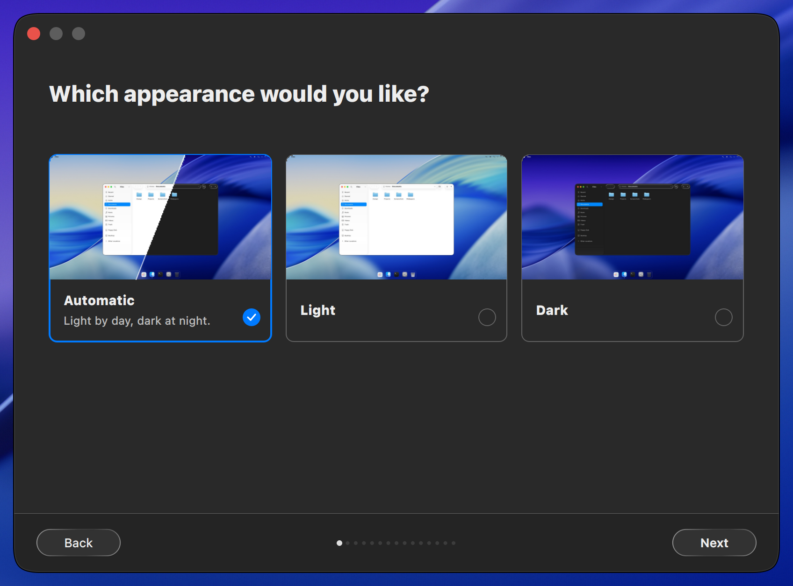
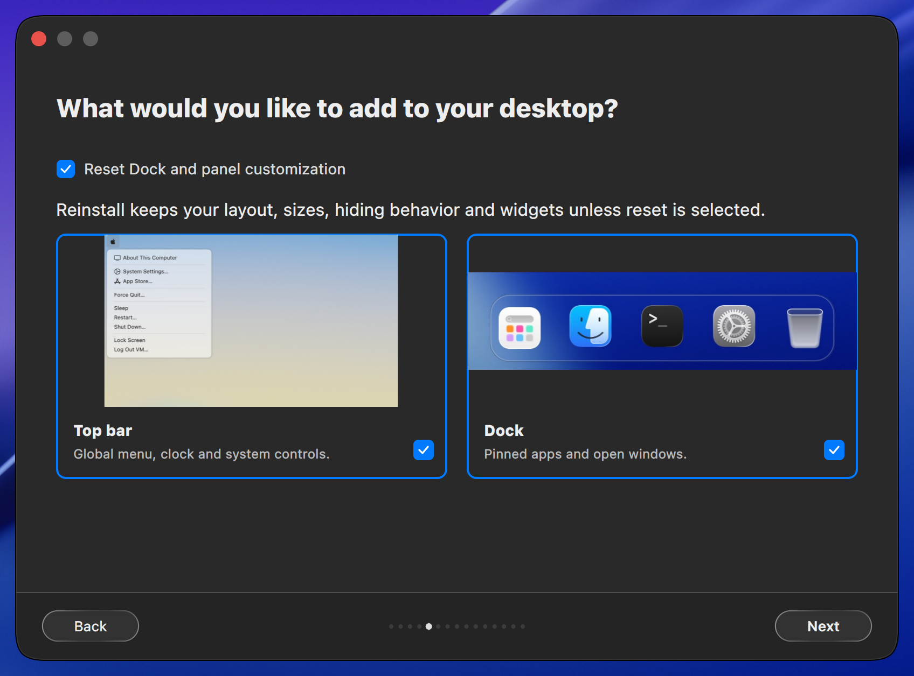
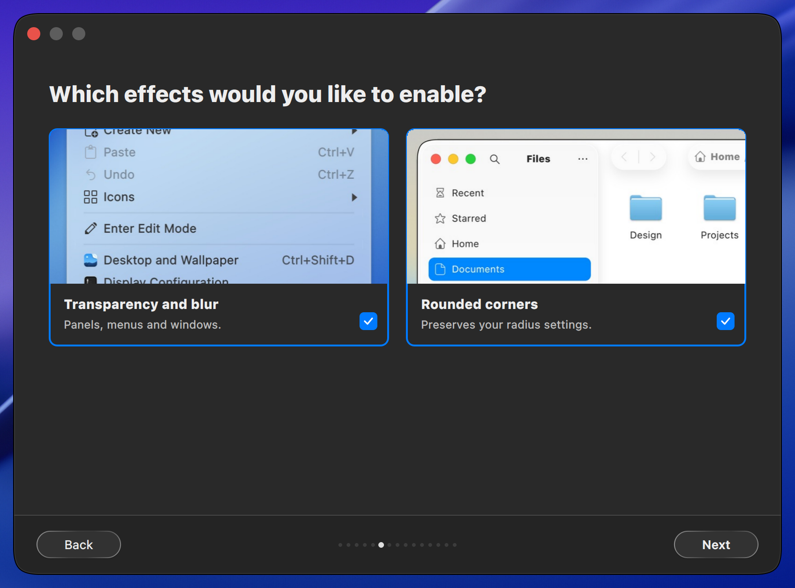
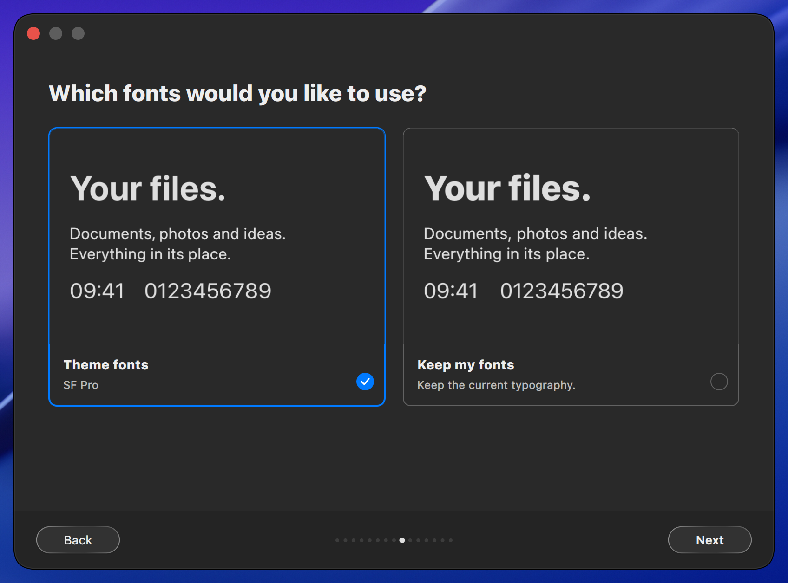
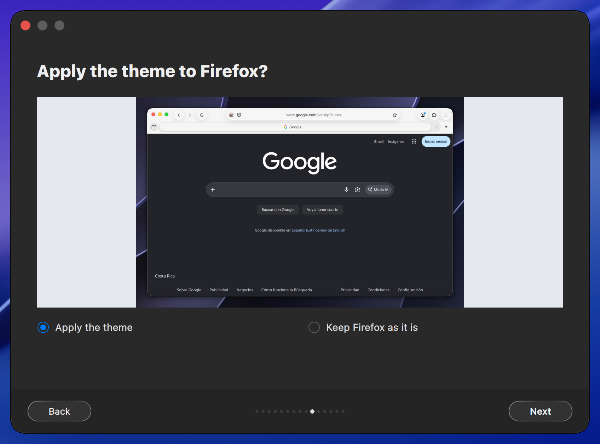
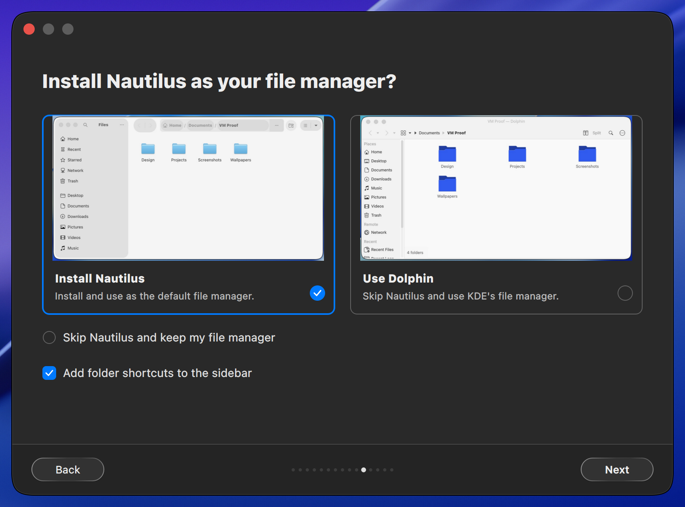
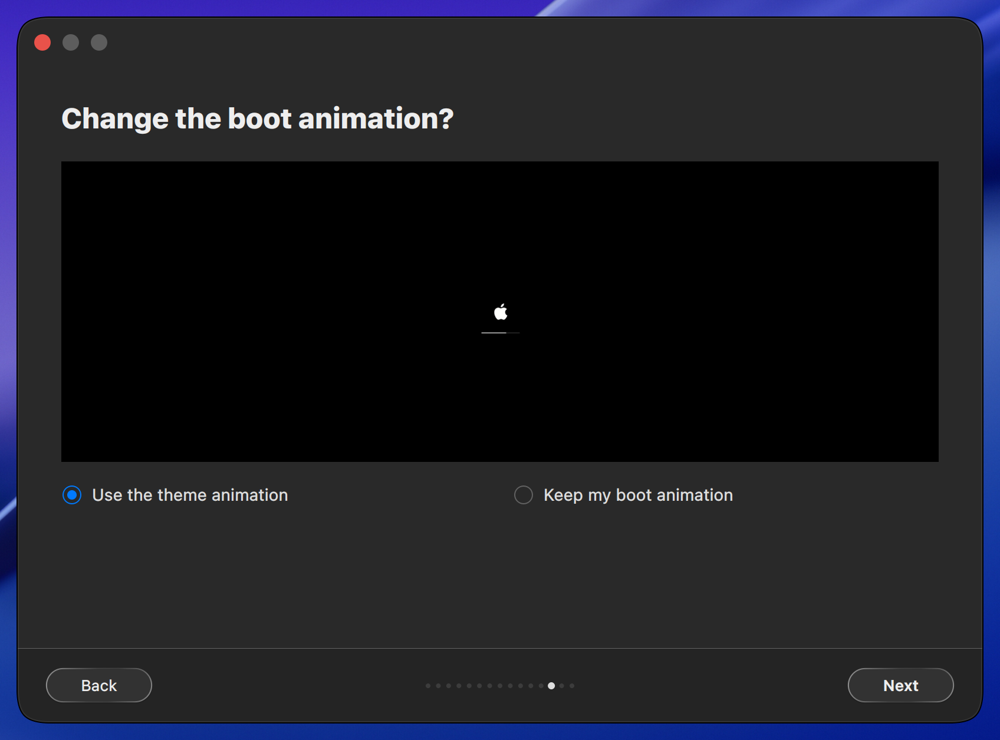

# Installer testing

Tahoe **v0.63.1** fixes Dock spacing at a 56 px center pitch on the default
68 px panel, preserving 42 px visible icons. The spacing selector is removed;
legacy saved values no longer affect geometry. Both editions share the change.

Focused KDE neon VM checks passed: 20 Dock regressions across orientations,
compression and display scales, plus 7 task-manager/install regressions.
Golden Gate light/dark/light captures preserve icon size and spacing. See
[validation evidence](tests/dock_spacing_validation.json) for commands and limits.
Release publication additionally requires exact-commit CI on main and dev.

## Installation steps

Scroll horizontally through the installation steps.

<table>
<tr>
  <td align="center"> Welcome</td>
  <td align="center"> Appearance</td>
  <td align="center"> Icons and color</td>
  <td align="center"> Wallpaper</td>
  <td align="center"> Launcher</td>
  <td align="center"> Top bar and Dock</td>
  <td align="center"> Effects</td>
  <td align="center"> Window controls</td>
  <td align="center"> Window shadows</td>
  <td align="center"> Fonts</td>
  <td align="center"> Firefox</td>
  <td align="center"> File manager</td>
  <td align="center"> Window glass</td>
  <td align="center"> Boot animation</td>
  <td align="center"> OLED protection</td>
  <td align="center"> Summary</td>
</tr>
</table>
